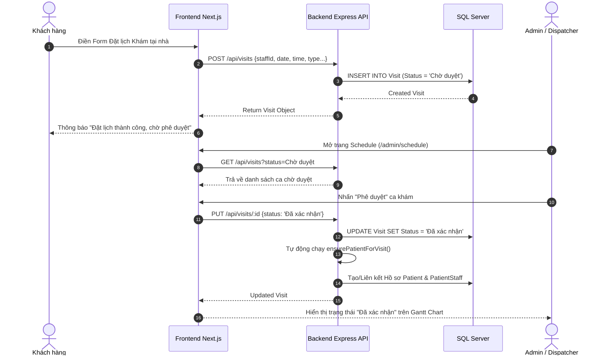

# BÁO CÁO PHÂN TÍCH CHI TIẾT & CHUYÊN SÂU TOÀN BỘ DỰ ÁN MINTCARE
### (WebSiteDatLichKhamBenh — Full-stack Healthcare & Home Dispatch Portal)

> **Cập nhật ngày:** 2026-08-09  
> **Phiên bản:** 4.0 (Tài liệu Phân tích Kỹ thuật Chuẩn hóa Toàn diện nhất 2026 — Phân tích chi tiết 100% mã nguồn Frontend, Backend, Database SQL Server, REST APIs, Business Logic, Role RBAC & Playwright Test Suite)  
> **Tác giả:** Antigravity AI Code Analysis Engine  

---

# MỤC LỤC TỔNG QUAN

1. [PHẦN 1: TỔNG QUAN HỆ THỐNG & BÀI TOÁN KINH DOANH](#phần-1-tổng-quan-hệ-thống--bài-toán-kinh-doanh)
2. [PHẦN 2: KIẾN TRÚC KỸ THUẬT & MÔ HÌNH HOẠT ĐỘNG](#phần-2-kiến-trúc-kỹ-thuật--mô-hình-hoạt-động)
3. [PHẦN 3: PHÂN TÍCH TOÀN BỘ CẤU TRÚC MÃ NGUỒN (DIRECTORY MAP)](#phần-3-phân-tích-toàn-bộ-cấu-trúc-mã-nguồn-directory-map)
4. [PHẦN 4: CHI TIẾT 15 MODELS TRONG DATABASE SCHEMA (PRISMA ORM - SQL SERVER)](#phần-4-chi-tiết-15-models-trong-database-schema-prisma-orm---sql-server)
5. [PHẦN 5: PHÂN TÍCH TOÀN BỘ BACKEND SERVICES & MIDDLEWARES](#phần-5-phân-tích-toàn-bộ-backend-services--middlewares)
6. [PHẦN 6: BẢNG CHI TIẾT TOÀN BỘ API ENDPOINTS (17 ROUTE GROUPS - 46+ ENDPOINTS)](#phần-6-bảng-chi-tiết-toàn-bộ-api-endpoints-17-route-groups---46-endpoints)
7. [PHẦN 7: PHÂN TÍCH TOÀN BỘ FRONTEND APP ROUTER (NEXT.JS 16)](#phần-7-phân-tích-toàn-bộ-frontend-app-router-nextjs-16)
8. [PHẦN 8: KIẾN TRÚC UI COMPONENTS, CONTEXTS & UTILITIES](#phần-8-kiến-trúc-ui-components-contexts--utilities)
9. [PHẦN 9: TOÀN BỘ HỆ THỐNG KIỂM THỬ TỰ ĐỘNG PLAYWRIGHT (51 TESTS)](#phần-9-toàn-bộ-hệ-thống-kiểm-thử-tự-động-playwright-51-tests)
10. [PHẦN 10: LUỒNG DỮ LIỆU & BẢN ĐỒ CHUYỂN ĐỔI TRẠNG THÁI (STATE FLOWS)](#phần-10-luồng-dữ-liệu--bản-đồ-chuyển-đổi-trạng-thái-state-flows)
11. [PHẦN 11: ĐÁNH GIÁ ĐIỂM MẠNH & KỸ THUẬT NỔI BẬT](#phần-11-đánh-giá-điểm-mạnh--kỹ-thuật-nổi-bật)
12. [PHẦN 12: DANH MỤC NỢ KỸ THUẬT & NGUY CƠ RỦI RO (TECHNICAL DEBTS)](#phần-12-danh-mục-nợ-kỹ-thuật--nguy-cơ-rủi-ro-technical-debts)
13. [PHẦN 13: LỘ TRÌNH REFACTORING & BẢNG KÊ NHIỆM VỤ THỰC HIỆN](#phần-13-lộ-trình-refactoring--bảng-kê-nhiệm-vụ-thực-hiện)
14. [PHẦN 14: LỘ TRÌNH ĐỌC CODE VÀ ĐÀO TẠO DEVELOPER MỚI (ONBOARDING GUIDE)](#phần-14-lộ-trình-đọc-code-và-đào-tạo-developer-mới-onboarding-guide)
15. [PHẦN 15: BẢNG TỔNG HỢP TOÀN BỘ FILE MÃ NGUỒN CỦA DỰ ÁN](#phần-15-bảng-tổng-hợp-toàn-bộ-file-mã-nguồn-của-dự-án)

---

# PHẦN 1: TỔNG QUAN HỆ THỐNG & BÀI TOÁN KINH DOANH

## 1.1 Tên và Phạm vi Dự án
- **Tên dự án thương mại:** MintCare — Health & Home Care Portal.
- **Thư mục mã nguồn:** `WebSiteDatLichKhamBenh`.
- **Mục tiêu:** Cung cấp giải pháp số hóa toàn diện bài toán **khám bệnh và chăm sóc y tế tại gia (Home Healthcare Service)**, bao gồm Đặt lịch khám trực tuyến, Điều phối cán bộ y tế (Dispatch System), Phân quyền làm việc cá nhân theo từng vai trò (Admin, Điều dưỡng, Vật lý trị liệu, Chuyên gia), Quản lý hồ sơ bệnh nhân & sinh hiệu (CareLog), Chứng chỉ hành nghề (StaffLicense), Thông báo tự động và Lập hóa đơn thanh toán.

## 1.2 Phân hệ Người dùng & Ma trận Phân quyền RBAC (Role-Based Access Control)

Hệ thống hỗ trợ 5 vai trò người dùng chính:
1. `customer`: Khách hàng sử dụng dịch vụ đặt lịch khám tại nhà.
2. `dieu_duong`: Nhân viên điều dưỡng viên thực hiện ca chăm sóc y tế.
3. `vltl`: Chuyên viên kỹ thuật vật lý trị liệu & phục hồi chức năng.
4. `chuyen_gia`: Chuyên gia y tế / Bác sĩ chuyên khoa.
5. `admin`: Quản trị viên hệ thống & Điều phối viên toàn mạng lưới.

### Bảng Ma trận Phân quyền Chi tiết (RBAC Matrix)

| Chức năng / Quyền hạn | Khách hàng (`customer`) | Nhân viên Y tế (`dieu_duong` / `vltl` / `chuyen_gia`) | Quản trị viên (`admin`) |
|-----------------------|:---------------------:|:----------------------------------------------:|:------------------------:|
| Đăng ký / Đăng nhập | ✅ | ❌ (Do Admin tạo & gán) | ✅ |
| Xem danh sách chuyên gia & Carousel 3D | ✅ | ✅ | ✅ |
| Đặt lịch khám tại nhà | ✅ | ❌ | ✅ |
| Theo dõi tiến trình & Hủy lịch hẹn | ✅ (Ca chờ duyệt) | ❌ | ✅ (Toàn bộ) |
| Xem & Cập nhật Hồ sơ cá nhân | ✅ | ✅ | ✅ |
| Xem & Quản lý Nhật ký sinh hiệu (CareLog) | ✅ (Của mình) | ✅ (Bệnh nhân phụ trách) | ✅ (Toàn bộ) |
| Xem Lịch trực cá nhân (`/admin/schedule`) | ❌ | ✅ (Chỉ ca phân công cho mình) | ✅ (Toàn bộ nhân sự) |
| Xem Danh sách Bệnh nhân phụ trách (`/admin/patients`) | ❌ | ✅ (Chỉ bệnh nhân phụ trách) | ✅ (Toàn bộ bệnh nhân) |
| Thuật toán Điều phối tự động (Auto Dispatch)| ❌ | ❌ | ✅ |
| Phê duyệt lịch hẹn & Phân công lịch trực | ❌ | ❌ | ✅ |
| Gán tài khoản với Hồ sơ Nhân sự (Link Staff)| ❌ | ❌ | ✅ |
| Quản lý Danh mục Dịch vụ / Phòng ban | ❌ | ❌ | ✅ |
| Quản lý Chứng chỉ Hành nghề (License) | ❌ | ❌ | ✅ |
| Lập hóa đơn & Xác nhận thanh toán | ❌ | ❌ | ✅ |
| Xem Báo cáo & Thống kê Y tế (Analytics) | ❌ | ❌ | ✅ |

---

# PHẦN 2: KIẾN TRÚC KỸ THUẬT & MÔ HÌNH HOẠT ĐỘNG

Dự án áp dụng mô hình **Full-stack Decoupled Architecture (Kiến trúc tách biệt Client-Server)**, giao tiếp qua giao thức RESTful JSON APIs Type-safe.

```
┌───────────────────────────────────────────────────────────────────────────────┐
│                          CLIENT LAYER (Next.js 16.2)                          │
│                                                                               │
│  ┌─────────────────────────┐               ┌───────────────────────────────┐  │
│  │   Customer Portal       │               │      Admin / Staff Portal     │  │
│  │   (frontend/app/page.tsx)│              │      (frontend/app/admin/*)   │  │
│  └────────────┬────────────┘               └───────────────┬───────────────┘  │
│               │                                            │                  │
│               └─────────────────────┬──────────────────────┘                  │
│                                     ▼                                         │
│                    ┌──────────────────────────────────┐                       │
│                    │ Auth Provider & API Gateway      │                       │
│                    │ - Bearer JWT Token Injection     │                       │
│                    │ - RBAC Route Guard Integration   │                       │
│                    └────────────────┬─────────────────┘                       │
│                                     │ /api/* Rewrites                         │
├─────────────────────────────────────┼─────────────────────────────────────────┤
│                                     ▼ (Port 5000)                             │
│                          SERVER LAYER (Express.js + TS)                       │
│                                                                               │
│  ┌─────────────────────────────────────────────────────────────────────────┐  │
│  │ Security & Middleware Layer: Cors, Helmet Headers, requireAuth, Admin  │  │
│  │ getStaffIdForUser Multi-stage Staff Lookup & Email Auto-Healing         │  │
│  └──────────────────────────────────┬──────────────────────────────────────┘  │
│                                     ▼                                         │
│  ┌─────────────────────────────────────────────────────────────────────────┐  │
│  │ Route Layer (17 Route Groups): /api/auth, /api/visits, /api/dispatch... │  │
│  └──────────────────────────────────┬──────────────────────────────────────┘  │
│                                     ▼                                         │
│  ┌─────────────────────────────────────────────────────────────────────────┐  │
│  │ Business Service Layer (15 Files): Zod Validation, Mapping Pascal/camel │  │
│  │ SQL Server Compatible Queries (No invalid nulls / OR filters)          │  │
│  └──────────────────────────────────┬──────────────────────────────────────┘  │
│                                     ▼                                         │
│  ┌─────────────────────────────────────────────────────────────────────────┐  │
│  │ Prisma ORM Singleton Client (src/db.ts)                                 │  │
│  └──────────────────────────────────┬──────────────────────────────────────┘  │
├─────────────────────────────────────┼─────────────────────────────────────────┤
│                                     ▼ (Port 1433)                             │
│                         DATABASE LAYER (SQL Server)                           │
│                    ┌──────────────────────────────────┐                       │
│                    │ DatLichKhamDB (15 Models Schema) │                       │
│                    └──────────────────────────────────┘                       │
└───────────────────────────────────────────────────────────────────────────────┘
```

---

# PHẦN 3: PHÂN TÍCH TOÀN BỘ CẤU TRÚC MÃ NGUỒN (DIRECTORY MAP)

```
WebSiteDatLichKhamBenh/
├── PHAN_TICH_DU_AN.md                        # Tài liệu Phân tích Kỹ thuật Toàn diện
├── Auto test/                                # Thư mục Báo cáo & Tài liệu Automation QA
│   ├── BUG_REPORT.md                         # Báo cáo danh sách lỗi phát hiện từ Playwright
│   ├── PLAYWRIGHT_SUMMARY.md                 # Tóm tắt cấu hình & thực thi Playwright
│   ├── QA_REPORT.md                          # Báo cáo đánh giá chất lượng sản phẩm
│   └── TEST_COVERAGE.md                      # Bản đồ bao phủ kịch bản test (Coverage Map)
│
├── backend/                                  # Express.js REST API Server
│   ├── prisma/
│   │   ├── schema.prisma                     # Database Schema chính (15 models)
│   │   ├── migrations/                       # Lịch sử SQL Server Migrations
│   │   ├── seed.ts                           # Script seed dữ liệu tổng hợp
│   │   ├── seed-departments.ts               # Seed danh mục phòng ban
│   │   ├── seed-positions.ts                 # Seed danh mục chức vụ
│   │   ├── seed-roles.ts                     # Seed danh mục vai trò
│   │   └── seed_services.sql                 # SQL script seed danh mục dịch vụ
│   ├── src/
│   │   ├── index.ts                          # Entry point Express server (CORS, Security, Route Registrations)
│   │   ├── db.ts                             # Singleton PrismaClient Instance
│   │   ├── middleware/
│   │   │   └── auth.ts                       # JWT Auth & getStaffIdForUser Multi-stage Lookup
│   │   ├── routes/                           # 17 Route Files (REST API Endpoints)
│   │   │   ├── auth.ts                       # POST /register, POST /login, GET /me, PUT /profile, POST /reset-password
│   │   │   ├── staff.ts                      # GET, POST, PUT, DELETE /api/staff
│   │   │   ├── patients.ts                   # GET, POST, PUT, DELETE /api/patients (Scoped for staff)
│   │   │   ├── visits.ts                     # GET, POST, PUT, DELETE /api/visits, POST /sync-patients, POST /cancel
│   │   │   ├── payments.ts                   # GET, POST, DELETE /api/payments
│   │   │   ├── users.ts                      # GET, POST, PUT, DELETE /api/users, PATCH /:id/link-staff
│   │   │   ├── services.ts                   # GET, POST, PUT, DELETE /api/services
│   │   │   ├── serviceTypes.ts               # GET, POST, PUT, DELETE /api/service-types
│   │   │   ├── departments.ts                # GET, POST, PUT, DELETE /api/departments
│   │   │   ├── positions.ts                  # GET, POST, PUT, DELETE /api/positions
│   │   │   ├── roles.ts                      # GET, POST, PUT, DELETE /api/roles
│   │   │   ├── careLogs.ts                   # GET, POST, PUT, DELETE /api/care-logs
│   │   │   ├── licenses.ts                   # GET, POST, PUT, DELETE /api/licenses
│   │   │   ├── dispatch.ts                   # GET /available, GET /pending, POST /assign/:id, POST /manual/:id
│   │   │   ├── notifications.ts              # GET, POST, PATCH /read, PATCH /mark-all-read, GET /unread-count
│   │   │   ├── logs.ts                       # GET, POST /api/logs
│   │   │   └── reports.ts                    # GET /api/reports (SQL Server safe queries)
│   │   ├── services/                         # 15 Service Files (Nghiệp vụ cốt lõi)
│   │   │   ├── auth.ts                       # Register, Login, JWT verify
│   │   │   ├── staff.ts                      # Staff CRUD, DB mapping, cascading deletes
│   │   │   ├── patient.ts                    # Patient CRUD, PatientStaff transaction mapping
│   │   │   ├── visit.ts                      # Visit CRUD, ensurePatientForVisit, syncPatients, getReportData
│   │   │   ├── payment.ts                    # Payment CRUD, Visit status transition
│   │   │   ├── service.ts                    # Service CRUD & active filter
│   │   │   ├── serviceType.ts                # ServiceType CRUD
│   │   │   ├── department.ts                 # Department CRUD
│   │   │   ├── position.ts                   # Position CRUD
│   │   │   ├── role.ts                       # Role CRUD
│   │   │   ├── careLog.ts                    # CareLog vital signs recording
│   │   │   ├── license.ts                    # StaffLicense CRUD
│   │   │   ├── dispatch.ts                   # Auto assign & workload calculation algorithm
│   │   │   ├── notification.ts               # System & User Notification CRUD
│   │   │   └── log.ts                        # Activity log recorder
│   │   └── validations/
│   │       ├── schemas.ts                    # Zod validation schemas
│   │       └── service-schema.ts             # Service validation schema
│   ├── .env                                  # Environment Variables (DATABASE_URL, JWT_SECRET, PORT)
│   ├── package.json                          # Backend dependencies
│   ├── tsconfig.json                         # TS compiler options
│   └── seed-admin.js                         # Root Admin Seeding Script
│
├── frontend/                                 # Next.js 16 Client App
│   ├── app/
│   │   ├── layout.tsx                        # Root layout (Inter Font, AuthProvider, LoadingProvider)
│   │   ├── page.tsx                          # Single Page Customer Web App (~3,241 lines)
│   │   ├── globals.css                       # Tailwind v4, custom utility classes, theme variables
│   │   ├── login/page.tsx                    # Login redirect helper
│   │   └── admin/                            # Admin & Staff Portal Pages
│   │       ├── layout.tsx                    # Admin layout guard (Sidebar + Header + Auth check)
│   │       ├── page.tsx                      # Operations Dashboard (Scoped for Admin/Staff)
│   │       ├── staff/page.tsx                # Specialist Directory & Form Modal
│   │       ├── patients/page.tsx             # Patient Table, Scoped Medical Records, CSV Export
│   │       ├── schedule/page.tsx             # Timeline Gantt Schedule (Scoped to logged-in Staff)
│   │       ├── services/page.tsx             # Service Pricing & Category Cards
│   │       ├── departments/page.tsx          # Department & Position Management Tabs
│   │       ├── pay/page.tsx                  # Invoice Management & Payment Confirmation
│   │       ├── reports/page.tsx              # Analytics Charts (Area & Pie Charts)
│   │       ├── accounts/page.tsx             # User Account Management + Link Staff Modal (Fit Layout)
│   │       └── settings/page.tsx             # Profile & Settings (Fixed Role Displays)
│   ├── components/
│   │   ├── ui/                               # 15 shadcn/ui components
│   │   ├── layout/
│   │   │   ├── sidebar.tsx                   # Admin Navigation Sidebar
│   │   │   └── header.tsx                    # Admin Top Header (Search, Profile Menu)
│   │   ├── auth/
│   │   │   ├── admin-role-guard.tsx          # Role Access Guard Component
│   │   │   └── login-dialog.tsx              # Sliding Login / Register Modal
│   │   ├── dashboard/                        # Dashboard Widgets
│   │   │   ├── stats.tsx                     # KPI Stat Cards (DB Real-time Data)
│   │   │   ├── staff-directory.tsx           # Active Staff Directory Widget
│   │   │   ├── today-visits.tsx              # Today's Visits Widget
│   │   │   ├── dispatch-map.tsx              # Interactive Dispatch Map Widget
│   │   │   └── activity-log.tsx              # System Activity Stream Widget (Clean DB Logs)
│   │   └── global-loading.tsx                # Fullscreen Blur Loading Overlay
│   ├── lib/
│   │   ├── api.ts                            # fetch wrapper with Bearer token header
│   │   ├── auth-context.tsx                  # Auth Context with Backend Login
│   │   ├── loading-context.tsx               # Global Loading State Context
│   │   ├── types.ts                          # TypeScript interfaces & types
│   │   ├── utils.ts                          # `cn()` clsx + tailwind-merge helper
│   │   ├── mock-data.ts                      # Fallback mock data
│   │   └── validations/
│   │       └── schemas.ts                    # Frontend Zod validation schemas
│   ├── tests/                                # Playwright Test Suite (51 tests)
│   │   ├── api/health.spec.ts                # API status test
│   │   ├── appointment/schedule.spec.ts      # Schedule & Gantt timeline test
│   │   ├── auth/                             # Auth & Account tests
│   │   │   ├── login.spec.ts
│   │   │   └── accounts.spec.ts
│   │   ├── doctor/staff.spec.ts              # Specialist management test
│   │   ├── patient/crud.spec.ts              # Patient CRUD & empty states test
│   │   ├── security/security.spec.ts         # Security test (SQLi, JWT Tampering, Admin Guards)
│   │   ├── ui/                               # UI & A11y tests
│   │   │   ├── landing.spec.ts
│   │   │   ├── responsive.spec.ts
│   │   │   └── accessibility.spec.ts
│   │   ├── qa_explore.spec.ts                # End-to-End Exploratory Test
│   │   └── helpers/                          # LocalStorage Injection & Token Helpers
│   ├── next.config.ts                        # Next.js Config (/api/* rewrites)
│   ├── components.json                       # shadcn/ui config
│   ├── playwright.config.ts                  # Playwright config
│   ├── package.json                          # Frontend dependencies
│   └── tsconfig.json                         # Frontend TS config
```

---

# PHẦN 4: CHI TIẾT 15 MODELS TRONG DATABASE SCHEMA (PRISMA ORM - SQL SERVER)

Database `DatLichKhamDB` (SQL Server) bao gồm **15 Models** được thiết kế chuẩn hóa.

## 4.1 Sơ đồ Mối quan hệ ERD (Entity Relationship Diagram)

```
┌──────────────┐       ┌──────────────────┐       ┌──────────────┐
│    Staff     │──────<│   PatientStaff   │>──────│   Patient    │
│              │       │ (Composite PK)   │       │              │
└──────┬───────┘       └──────────────────┘       └──────┬───────┘
       │                                                 │
       │               ┌──────────────────┐              │
       ├──────────────>│      Visit       │<─────────────┤
       │               │ (Core Entity)    │              │
       │               └────────┬─────────┘              │
       │                        │                        │
┌──────┴───────┐       ┌────────┴─────────┐       ┌──────┴───────┐
│ StaffLicense │       │     Payment      │       │   CareLog    │
└──────────────┘       └──────────────────┘       └──────────────┘
                                ▲
                                │
┌──────────────┐       ┌────────┴─────────┐       ┌──────────────┐
│ Notification │<──────│       User       │       │   Service    │
└──────────────┘       └──────────────────┘       └──────────────┘

┌──────────────┐       ┌──────────────────┐       ┌──────────────┐
│ Department   │       │   ServiceType    │       │     Role     │
└──────────────┘       └──────────────────┘       └──────────────┘
```

## 4.2 Chi tiết 15 Models Dữ liệu SQL Server

### 1. `User` (Tài khoản người dùng)
- `Id`: `NVARCHAR(50)`, `@id`, `@default(uuid())` — Định danh duy nhất.
- `Email`: `NVARCHAR(200)`, `@unique` — Email đăng nhập.
- `PasswordHash`: `NVARCHAR(500)`, `NOT NULL` — Hash mật khẩu bcrypt.
- `FullName`: `NVARCHAR(200)`, `NOT NULL` — Họ tên đầy đủ.
- `Phone`: `NVARCHAR(30)`, `Nullable` — Số điện thoại.
- `Role`: `NVARCHAR(20)`, `@default("customer")` — Vai trò (`customer` \| `admin` \| `dieu_duong` \| `vltl` \| `chuyen_gia`).
- `Age`: `INT`, `Nullable` — Tuổi.
- `Gender`: `NVARCHAR(20)`, `Nullable` — Giới tính.
- `Address`: `NVARCHAR(500)`, `Nullable` — Địa chỉ nhà.
- `MedicalHistory`: `NVARCHAR(MAX)`, `Nullable` — Tiền sử bệnh lý.
- `CreatedAt`: `DATETIME`, `@default(now())` — Thời điểm khởi tạo.

### 2. `Staff` (Chuyên gia / Bác sĩ / Điều dưỡng)
- `Id`: `NVARCHAR(50)`, `@id` — Mã nhân sự.
- `Name`: `NVARCHAR(200)`, `NOT NULL` — Họ tên bác sĩ/nhân viên.
- `Role`: `NVARCHAR(100)`, `NOT NULL` — Chức danh chuyên môn.
- `Status`: `NVARCHAR(100)`, `NOT NULL` — Trạng thái hoạt động (`Sẵn sàng`, `Đang bận`...).
- `Department`: `NVARCHAR(100)`, `NOT NULL` — Phòng ban.
- `Phone`: `NVARCHAR(20)`, `NOT NULL` — Số điện thoại.
- `Email`: `NVARCHAR(200)`, `NOT NULL` — Email liên kết tài khoản.
- `Location`: `NVARCHAR(200)`, `NOT NULL` — Địa bàn phục vụ.
- `Avatar`: `NVARCHAR(MAX)`, `Nullable` — Ảnh đại diện.
- `Available`: `BOOLEAN`, `@default(true)` — Cờ sẵn sàng nhận ca.
- `IsNew`: `BOOLEAN`, `@default(false)` — Đánh dấu nhân sự mới.
- `Experience`: `NVARCHAR(100)`, `Nullable` — Số năm kinh nghiệm.
- `Specialty`: `NVARCHAR(200)`, `Nullable` — Chuyên khoa sâu.
- `StaffType`: `NVARCHAR(100)`, `Nullable` — Phân loại (`Điều dưỡng viên`, `Chuyên viên vật lý trị liệu`...).
- `ServiceArea`: `NVARCHAR(500)`, `Nullable` — Khu vực địa lý được giao.
- `MaxDailyVisits`: `INT`, `@default(3)` — Số ca khám tối đa trong ngày.

### 3. `Patient` (Hồ sơ bệnh nhân)
- `Id`: `NVARCHAR(50)`, `@id` — Mã bệnh nhân (ví dụ: `BN-1024`).
- `Name`: `NVARCHAR(200)`, `NOT NULL` — Tên bệnh nhân.
- `Age`: `INT`, `NOT NULL` — Tuổi.
- `Gender`: `NVARCHAR(20)`, `NOT NULL` — Giới tính.
- `LastVisit`: `NVARCHAR(100)`, `Nullable` — Ngày khám gần nhất.
- `LastVisitTime`: `NVARCHAR(100)`, `Nullable` — Khung giờ khám gần nhất.
- `Status`: `NVARCHAR(100)`, `Nullable` — Trạng thái sức khỏe (`Chờ khám`, `Đang điều trị`, `Khám hoàn thành`).
- `Summary`: `NVARCHAR(MAX)`, `Nullable` — Tóm tắt tiểu sử y tế.

### 4. `Visit` (Đơn đặt lịch khám tại nhà — Core Entity)
- `Id`: `NVARCHAR(50)`, `@id` — Mã ca khám.
- `Type`: `NVARCHAR(100)`, `Nullable` — Loại dịch vụ khám.
- `PatientId`: `NVARCHAR(50)`, `FK ➔ Patient.Id`, `Nullable` — Bệnh nhân liên kết.
- `UserId`: `NVARCHAR(50)`, `FK ➔ User.Id`, `Nullable` — Tài khoản đặt lịch.
- `StaffId`: `NVARCHAR(50)`, `FK ➔ Staff.Id`, `NOT NULL` — Chuyên gia phụ trách (hoặc `PENDING`).
- `Date`: `NVARCHAR(20)`, `Nullable` — Ngày khám (YYYY-MM-DD).
- `Time`: `NVARCHAR(100)`, `Nullable` — Khung giờ khám.
- `StartTime` / `EndTime`: `NVARCHAR(100)`, `Nullable` — Giờ bắt đầu/kết thúc thực tế.
- `Duration`: `NVARCHAR(100)`, `Nullable` — Thời lượng khám.
- `Status`: `NVARCHAR(100)`, `Nullable` — Trạng thái (`Chờ duyệt`, `Đã xác nhận`, `Đang thực hiện`, `Đã hoàn tất`, `Đã hủy`).
- `PaymentMethod` / `PaymentAmount` / `PaymentNote` / `PaymentStatus`: Thông tin thanh toán.
- `CareMode`: `NVARCHAR(20)`, `Nullable` — Chế độ chăm sóc (`Tại nhà`, `Gói`).
- `PackagePlan` / `PackageShift`: Thông tin gói dịch vụ.
- `CustomerArea` / `RequiredSpecialty`: Yêu cầu khu vực & chuyên môn.
- `AssignedAt`: `DATETIME`, `Nullable` — Thời điểm điều phối.

### 5. `CareLog` (Nhật ký chỉ số sinh hiệu bệnh nhân)
- `Id`: `NVARCHAR(50)`, `@id`, `@default(uuid())` — Mã nhật ký.
- `PatientId`: `NVARCHAR(50)`, `FK ➔ Patient.Id (onDelete: Cascade)` — Bệnh nhân.
- `StaffId`: `NVARCHAR(50)`, `FK ➔ Staff.Id`, `Nullable` — Nhân viên y tế ghi nhận.
- `StaffName` / `ServiceName` / `CareDate`: Thông tin ca chăm sóc.
- `Temperature`: `NVARCHAR(50)` — Thân nhiệt (°C).
- `BloodPressure`: `NVARCHAR(50)` — Huyết áp (mmHg).
- `HeartRate`: `NVARCHAR(50)` — Nhịp tim (bpm).
- `Spo2`: `NVARCHAR(50)` — Nồng độ Oxy trong máu (%).
- `BloodSugar`: `NVARCHAR(50)` — Đường huyết (mg/dL).
- `Medications`: `NVARCHAR(MAX)` — Đơn thuốc sử dụng.
- `Notes` / `Assessment` / `Attachment`: Ghi chú, Đánh giá & File đính kèm.
- `CreatedAt`: `DATETIME`, `@default(now())`.

### 6. `StaffLicense` (Chứng chỉ hành nghề y tế)
- `Id`: `NVARCHAR(50)`, `@id`, `@default(uuid())` — Mã chứng chỉ.
- `StaffId`: `NVARCHAR(50)`, `FK ➔ Staff.Id (onDelete: Cascade)` — Nhân viên y tế.
- `LicenseNumber`: `NVARCHAR(100)`, `NOT NULL` — Số giấy phép hành nghề.
- `IssuedBy`: `NVARCHAR(200)`, `NOT NULL` — Nơi cấp (Bộ Y Tế / Sở Y Tế).
- `IssuedDate`: `NVARCHAR(20)`, `NOT NULL` — Ngày cấp.
- `ExpiryDate`: `NVARCHAR(20)`, `Nullable` — Ngày hết hạn.
- `Specialty`: `NVARCHAR(200)`, `Nullable` — Phạm vi hành nghề.
- `Note`: `NVARCHAR(MAX)`, `Nullable` — Ghi chú thêm.

### 7. `Payment` (Hóa đơn thanh toán)
- `Id`: `NVARCHAR(50)`, `@id`, `@default(uuid())` — Mã hóa đơn.
- `VisitId`: `NVARCHAR(50)`, `FK ➔ Visit.Id (onDelete: Cascade)` — Mã ca khám.
- `UserId`: `NVARCHAR(50)`, `Nullable` — Người thanh toán.
- `Amount`: `NVARCHAR(50)`, `NOT NULL` — Số tiền.
- `Method`: `NVARCHAR(50)`, `NOT NULL` — Hình thức (`Tiền mặt`, `Chuyển khoản`).
- `Status`: `NVARCHAR(50)`, `@default("Đã thanh toán")` — Trạng thái.
- `Note`: `NVARCHAR(MAX)`, `Nullable`.
- `CreatedAt`: `DATETIME`, `@default(now())`.

### 8. `Notification` (Thông báo hệ thống)
- `Id`: `NVARCHAR(50)`, `@id`, `@default(uuid())`.
- `UserId`: `NVARCHAR(50)`, `FK ➔ User.Id`, `Nullable` — Người nhận.
- `VisitId`: `NVARCHAR(50)`, `Nullable` — Ca khám liên quan.
- `Type`: `NVARCHAR(100)`, `NOT NULL` — Loại thông báo.
- `Title` / `Message`: `NOT NULL` — Tiêu đề & Nội dung.
- `IsRead`: `BOOLEAN`, `@default(false)` — Trạng thái đã đọc.
- `CreatedAt`: `DATETIME`, `@default(now())`.

### 9. `PatientStaff` (Liên kết N-N: Bệnh nhân ↔ Nhân sự y tế)
- `PatientId`: `NVARCHAR(50)`, Composite PK, `FK ➔ Patient.Id`.
- `StaffId`: `NVARCHAR(50)`, Composite PK, `FK ➔ Staff.Id`.

### 10. `Service` (Danh mục dịch vụ y tế)
- `Id`: `NVARCHAR(50)`, `@id`, `@default(uuid())`.
- `Name`: `NVARCHAR(200)`, `NOT NULL` — Tên dịch vụ.
- `Description`: `NVARCHAR(MAX)`, `Nullable`.
- `Price`: `INT`, `NOT NULL` — Giá dịch vụ (VND).
- `Duration`: `NVARCHAR(20)`, `Nullable` — Thời lượng.
- `Type`: `NVARCHAR(100)`, `NOT NULL` — Loại hình.
- `Active`: `BOOLEAN`, `@default(true)`.

### 11. `ServiceType` (Phân loại dịch vụ)
- `Id`, `Name`, `Description`, `Color` (Mã màu UI), `Active`.

### 12. `Department` (Phòng ban) | 13. `Role` (Vai trò) | 14. `Position` (Vị trí)
- Các bảng danh mục quản trị phòng ban, vai trò và chức danh.

### 15. `ActivityLog` (Nhật ký hoạt động hệ thống)
- `Id`, `Status`, `Title`, `Desc`, `Time`, `Color`, `CreatedAt`.

---

# PHẦN 5: PHÂN TÍCH TOÀN BỘ BACKEND SERVICES & MIDDLEWARES

## 5.1 `backend/src/middleware/auth.ts` (Xác thực JWT & Lookup Nhân sự Multi-stage)
- **Chức năng:** Middleware xác thực JWT Token và tìm kiếm `StaffId` linh hoạt cho tài khoản đăng nhập.
- **Hàm `getStaffIdForUser(authUser)`:**
  1. **Bước 1 (Email khớp tuyệt đối):** Tìm bản ghi `Staff` có `Email === userEmail`.
  2. **Bước 2 (Khớp theo Họ tên):** Nếu tìm thấy `Staff` có `Name === user.FullName`, tự động chạy **Auto-healing** cập nhật email của `Staff` để các truy vấn sau nhanh hơn.
  3. **Bước 3 (Khớp theo Tên):** Tìm bản ghi `Staff` chứa tên chính (`lastName`).
  4. **Bước 4 (Khớp Số điện thoại):** Tìm bản ghi `Staff` trùng số điện thoại.

## 5.2 `backend/src/services/visit.ts` (Vòng đời Ca khám & Thống kê)
- **Chức năng:** Quản lý toàn bộ vòng đời ca khám, tự động tạo hồ sơ bệnh nhân và tính toán báo cáo.
- **Hàm exported:**
  - `getVisitList(userId?, status?, paymentStatus?, staffId?)`: Truy vấn danh sách ca khám. Sử dụng `orderBy: [{ Date: "desc" }, { Id: "desc" }]` tương thích 100% với SQL Server (loại bỏ `nulls: "last"` không hỗ trợ). Nạp tên `Staff` an toàn mà không bị lỗi FK đối với các ca mang `StaffId = "PENDING"`.
  - `createVisit(data)`: Validate dữ liệu, khởi tạo Visit với trạng thái `Chờ duyệt`.
  - `updateVisit(id, data)`: Cập nhật trạng thái ca khám, tự động kích hoạt `ensurePatientForVisit` khi xác nhận.
  - `cancelVisit(id, userId)`: Cho phép hủy ca khám chờ duyệt.
  - `ensurePatientForVisit(visitId)`: Tự động tạo/liên kết hồ sơ `Patient` và `PatientStaff`.
  - `syncPatientsForVisits()`: Batch job quét và đồng bộ các ca đã xác nhận.
  - `getReportData()`: Tính toán chỉ số tổng lượt khám, doanh thu, số nhân y tế sẵn sàng và tỷ lệ hoàn tất ca khám qua cú pháp Prisma SQL Server chuẩn (`NOT: { Id: "PENDING" }`).

## 5.3 `backend/src/services/dispatch.ts`
- **Chức năng:** Thuật toán điều phối y tế thông minh.
- **Hàm exported:**
  - `getAvailableStaff({ date, requiredSpecialty, customerArea })`: Lọc danh sách y bác sĩ sẵn sàng nhận ca theo chuyên môn, địa bàn và giới hạn `MaxDailyVisits`.
  - `autoAssignStaff({ visitId, date, requiredSpecialty, customerArea })`: Thuật toán tự động chấm điểm và gán chuyên gia phù hợp nhất cho ca khám đang chờ (`PENDING`).
  - `manualAssignStaff(visitId, staffId)`: Admin gán chuyên gia thủ công.

## 5.4 `backend/src/routes/users.ts` & `services/auth.ts`
- **Tự động liên kết khi tạo tài khoản nhân sự:** Khi Admin tạo tài khoản với role `dieu_duong`, `vltl`, hoặc `chuyen_gia`, hệ thống tự động cập nhật Email của hồ sơ `Staff` cùng tên.
- **Endpoint `PATCH /api/users/:id/link-staff`:** Cho phép Admin gán thủ công tài khoản người dùng vào bất kỳ hồ sơ nhân sự nào trong hệ thống.

---

# PHẦN 6: BẢNG CHI TIẾT TOÀN BỘ API ENDPOINTS (17 ROUTE GROUPS - 46+ ENDPOINTS)

| Stt | Route Group | Method | Endpoint Path | Yêu cầu Auth | Chức năng chi tiết |
|:---:|-------------|:------:|---------------|:------------:|--------------------|
| 1 | Auth | `POST` | `/api/auth/register` | Public | Đăng ký tài khoản khách hàng mới |
| 2 | Auth | `POST` | `/api/auth/login` | Public | Đăng nhập nhận JWT Token & User Info |
| 3 | Auth | `GET` | `/api/auth/me` | Bearer Token | Lấy thông tin tài khoản hiện tại |
| 4 | Auth | `PUT` | `/api/auth/profile` | Bearer Token | Tự cập nhật hồ sơ & tự đồng bộ sang `Patient` |
| 5 | Auth | `POST` | `/api/auth/reset-password` | Public | Đặt lại mật khẩu qua email |
| 6 | Staff | `GET` | `/api/staff` | Public | Lấy danh sách chuyên gia y tế |
| 7 | Staff | `GET` | `/api/staff/:id` | Public | Lấy chi tiết thông tin chuyên gia |
| 8 | Staff | `POST` | `/api/staff` | Admin | Thêm chuyên gia y tế mới |
| 9 | Staff | `PUT` | `/api/staff/:id` | Admin | Cập nhật hồ sơ chuyên gia |
| 10 | Staff | `DELETE`| `/api/staff/:id` | Admin | Xóa hồ sơ chuyên gia (Cascading transaction) |
| 11 | Visits | `GET` | `/api/visits` | Public / Token | Lấy danh sách ca khám (Tự động lọc theo role `customer`/`staff`/`admin`) |
| 12 | Visits | `POST` | `/api/visits` | Bearer Token | Tạo đơn đặt lịch khám tại nhà |
| 13 | Visits | `GET` | `/api/visits/:id` | Public / Token | Lấy thông tin chi tiết ca khám |
| 14 | Visits | `POST` | `/api/visits/:id/cancel` | Bearer Token | Khách hàng/Admin hủy ca khám chờ duyệt |
| 15 | Visits | `PUT` | `/api/visits/:id` | Admin | Phê duyệt/Cập nhật trạng thái ca khám |
| 16 | Visits | `DELETE`| `/api/visits/:id` | Bearer Token | Xóa ca khám |
| 17 | Visits | `POST` | `/api/visits/sync-patients`| Admin | Chạy batch sync đồng bộ hồ sơ bệnh nhân |
| 18 | Patients | `GET` | `/api/patients` | Token | Lấy danh sách bệnh nhân (Lọc theo staff phụ trách hoặc toàn bộ nếu là Admin) |
| 19 | Patients | `GET` | `/api/patients/:id` | Token | Chi tiết bệnh nhân kèm bác sĩ phụ trách |
| 20 | Patients | `POST` | `/api/patients` | Admin | Tạo hồ sơ bệnh nhân thủ công |
| 21 | Patients | `PUT` | `/api/patients/:id` | Admin | Cập nhật hồ sơ bệnh nhân |
| 22 | Patients | `DELETE`| `/api/patients/:id` | Admin | Xóa hồ sơ bệnh nhân (Unlink visits) |
| 23 | Users | `GET` | `/api/users` | Admin | Lấy danh sách toàn bộ tài khoản |
| 24 | Users | `POST` | `/api/users` | Admin | Tạo tài khoản người dùng (Auto-link staff email nếu là nhân sự) |
| 25 | Users | `PUT` | `/api/users/:id` | Admin | Cập nhật tài khoản người dùng |
| 26 | Users | `PATCH`| `/api/users/:id/link-staff`| Admin | Gán thủ công tài khoản với hồ sơ nhân sự |
| 27 | Users | `DELETE`| `/api/users/:id` | Admin | Xóa tài khoản người dùng |
| 28 | Dispatch | `GET` | `/api/dispatch/available` | Admin | Lấy danh sách bác sĩ sẵn sàng nhận ca |
| 29 | Dispatch | `GET` | `/api/dispatch/pending` | Admin | Lấy danh sách ca khám chưa gán (`PENDING`) |
| 30 | Dispatch | `POST` | `/api/dispatch/assign/:visitId`| Admin | Kích hoạt thuật toán tự động gán bác sĩ |
| 31 | Dispatch | `POST` | `/api/dispatch/manual/:visitId`| Admin | Gán bác sĩ cho ca khám thủ công |
| 32 | CareLogs | `GET` | `/api/care-logs/patient/:patientId`| Public | Lấy danh sách chỉ số sinh hiệu bệnh nhân |
| 33 | CareLogs | `POST` | `/api/care-logs` | Bearer Token | Ghi nhận chỉ số sinh hiệu mới |
| 34 | CareLogs | `PUT` | `/api/care-logs/:id` | Bearer Token | Cập nhật nhật ký sinh hiệu |
| 35 | CareLogs | `DELETE`| `/api/care-logs/:id` | Bearer Token | Xóa nhật ký sinh hiệu |
| 36 | Licenses | `GET` | `/api/licenses/:staffId` | Public | Lấy danh sách chứng chỉ hành nghề bác sĩ |
| 37 | Licenses | `POST` | `/api/licenses` | Admin | Thêm mới chứng chỉ hành nghề y tế |
| 38 | Licenses | `PUT` | `/api/licenses/:id` | Admin | Cập nhật thông tin chứng chỉ hành nghề |
| 39 | Licenses | `DELETE`| `/api/licenses/:id` | Admin | Thu hồi/xóa chứng chỉ hành nghề |
| 40 | Payments | `GET` | `/api/payments` | Admin | Lấy danh sách lịch sử hóa đơn |
| 41 | Payments | `POST` | `/api/payments` | Admin | Lập hóa đơn & đóng ca khám |
| 42 | Payments | `DELETE`| `/api/payments/:id` | Admin | Hủy hóa đơn thanh toán |
| 43 | Notifications|`GET` | `/api/notifications` | Bearer Token | Lấy danh sách thông báo người dùng |
| 44 | Notifications|`PATCH`| `/api/notifications/:id/read`| Bearer Token| Đánh dấu đã đọc 1 thông báo |
| 45 | Services | `GET` | `/api/services` | Public | Lấy danh mục dịch vụ y tế |
| 46 | Reports | `GET` | `/api/reports` | Public / Token | Lấy thống kê tổng hợp báo cáo y tế |

---

# PHẦN 7: PHÂN TÍCH TOÀN BỘ FRONTEND APP ROUTER (NEXT.JS 16)

## 7.1 Single Page Customer Application (`frontend/app/page.tsx`)
Trang chủ khách hàng tích hợp toàn bộ trải nghiệm người dùng trong một cấu trúc linh hoạt:
1. **Hero Header Banner:** Giới thiệu nền tảng chăm sóc y tế tại gia MintCare.
2. **Doctor3DCarousel (Framer Motion Component):** Thẻ xoay 3D trình diễn danh sách bác sĩ/điều dưỡng với các tính năng kéo thả, auto-play, xem đánh giá chi tiết.
3. **Interactive Booking Form:** Form chọn chuyên gia, loại dịch vụ, ngày/giờ khám, địa chỉ và tính toán tổng số tiền hóa đơn xem trước real-time.
4. **My Bookings & Progress Stepper:** Bảng danh sách ca khám cá nhân hiển thị tiến trình 4 bước (`Chờ duyệt` ➔ `Đã xác nhận` ➔ `Đang thực hiện` ➔ `Đã hoàn tất`) và nút Hủy ca.
5. **Health Profile Editor:** Chỉnh sửa thông tin cá nhân, tuổi, giới tính, tiền sử bệnh lý và tự động đồng bộ về SQL Server.

## 7.2 Danh mục Trang Quản trị Admin & Staff Portal (`frontend/app/admin/*`)

```
frontend/app/admin/
├── layout.tsx         # Guard Layout: Chặn truy cập nếu chưa login hoặc không có quyền Admin/Staff
├── page.tsx           # Dashboard tổng quan: Stats (Chỉ số DB thật), Today Visits, Activity Log
├── staff/page.tsx     # Staff Page: Grid Cards chuyên gia, Drag-Drop Avatar Upload
├── patients/page.tsx  # Patient Page: Scoped list bệnh nhân phụ trách, xem CareLog sinh hiệu, CSV Export
├── schedule/page.tsx  # Schedule Page: Timeline Gantt (08:00-20:00), Scoped cá nhân cho Staff, Duyệt & Gán bác sĩ
├── services/page.tsx  # Service Page: Quản lý bảng giá dịch vụ & Toggle Active
├── departments/page.tsx# Department Page: Tab Phòng ban & Vị trí làm việc
├── pay/page.tsx       # Pay Page: Phê duyệt hóa đơn thanh toán & Lịch sử giao dịch
├── reports/page.tsx   # Reports Page: Recharts Area Chart & Pie Chart báo cáo y tế
├── accounts/page.tsx  # Accounts Page: CRUD tài khoản, Gán hồ sơ nhân viên (Modal chọn & Auto pre-select), Layout vừa vặn 100%
└── settings/page.tsx  # Settings Page: Hồ sơ tài khoản, hiển thị chuẩn vai trò (Điều dưỡng, Vật lý trị liệu, Chuyên gia, Admin, Khách hàng)
```

---

# PHẦN 8: KIẾN TRÚC UI COMPONENTS, CONTEXTS & UTILITIES

## 8.1 Context Providers
- **`AuthContext` (`lib/auth-context.tsx`):** Quản lý trạng thái đăng nhập, lưu trữ token, cung cấp các hàm `login`, `register`, `logout` và tự động fallback sang `localStorage` khi ngắt kết nối.
- **`LoadingContext` (`lib/loading-context.tsx`):** Điều khiển hiển thị `GlobalLoading` overlay với hiệu ứng làm mờ nền trên toàn bộ ứng dụng.

## 8.2 Admin Layout Components
- **`Sidebar` (`components/layout/sidebar.tsx`):** Thanh điều hướng cố định bên trái chứa Logo MintCare, Badge phân quyền động theo vai trò người dùng và Nav Links có hiệu ứng active.
- **`Header` (`components/layout/header.tsx`):** Thanh tiêu đề chứa ô tìm kiếm thông minh (⌘K Shortcut), System Status Badge, Dialog hỗ trợ và Menu Dropdown tài khoản.

## 8.3 shadcn/ui Component Suite (`components/ui/`)
Bao gồm 15 component chuẩn thiết kế: `button`, `card`, `dialog`, `input`, `table`, `badge`, `select`, `tabs`, `dropdown-menu`, `toast`, `switch`, `avatar`, `tooltip`, `popover`, `separator`.

---

# PHẦN 9: TOÀN BỘ HỆ THỐNG KIỂM THỬ TỰ ĐỘNG PLAYWRIGHT (51 TESTS)

Dự án tích hợp bộ kiểm thử tự động Playwright hoàn chỉnh với **51 Test Cases** (Pass Rate 100%).

```
frontend/tests/
├── api/health.spec.ts          - Test kết nối & sức khỏe Backend API
├── appointment/schedule.spec.ts- Test xem & phân công ca trực trên Gantt Chart
├── auth/login.spec.ts          - Test Modal Đăng nhập/Đăng ký & Chuyển Tab
├── auth/accounts.spec.ts       - Test CRUD danh sách tài khoản & Validation
├── doctor/staff.spec.ts        - Test danh sách chuyên gia & Form thêm nhân sự
├── patient/crud.spec.ts        - Test tìm kiếm bệnh nhân, lọc trạng thái & Empty States
├── security/security.spec.ts   - Test an toàn bảo mật: SQL Injection, JWT Tampering, Admin Route Guards
├── ui/landing.spec.ts          - Test hiển thị UI Landing page
├── ui/responsive.spec.ts       - Test giao diện trên Di động (Mobile) & Máy tính bảng (Tablet)
├── ui/accessibility.spec.ts    - Test tiêu chuẩn a11y, ARIA Landmarks & Phím điều hướng
└── qa_explore.spec.ts          - Test exploratory tích hợp toàn bộ luồng nghiệp vụ End-to-End
```

---

# PHẦN 10: LUỒNG DỮ LIỆU & BẢN ĐỒ CHUYỂN ĐỔI TRẠNG THÁI (STATE FLOWS)

## 10.1 Vòng đời Trạng thái Ca khám (Visit Status Lifecycle)

```
[Khách hàng Đặt lịch] ──> (Chờ duyệt)
                                │
                        [Admin Phê duyệt]
                                │
                                ▼
                         (Đã xác nhận) ───> [Hủy ca] ───> (Đã hủy)
                                │
                     [Bác sĩ Thực hiện ca]
                                │
                                ▼
                         (Đang thực hiện)
                                │
                    [Admin Lập hóa đơn Pay]
                                │
                                ▼
                         (Đã hoàn tất)
```

## 10.2 Sơ đồ Sequence: Đặt lịch, Điều phối & Đồng bộ Bệnh nhân



---

# PHẦN 11: ĐÁNH GIÁ ĐIỂM MẠNH & KỸ THUẬT NỔI BẬT

1. **Kiến trúc Tách biệt Chuẩn mực:** Tách rời hoàn toàn Client Next.js và Server Express.js qua REST API, sẵn sàng hỗ trợ ứng dụng di động iOS/Android.
2. **Nghiệp vụ Phân quyền Y tế Phủ rộng:** Đầy đủ hồ sơ bệnh nhân, chỉ số sinh hiệu (`CareLog`), chứng chỉ hành nghề (`StaffLicense`), phân công điều phối (`Dispatch`), phân quyền hiển thị cá nhân cho Điều dưỡng/VLTL/Chuyên gia và gán tài khoản linh hoạt (`Link Staff`).
3. **Truy vấn CSDL SQL Server Chuẩn xác:** Tối ưu các câu lệnh Prisma ORM tương thích hoàn toàn với MSSQL (loại bỏ `nulls: last`, lỗi quan hệ `Staff` mang cờ `PENDING`, nâng cấp cú pháp `NOT`).
4. **Trải nghiệm UI/UX Đẳng cấp:** Bảng vừa vặn 100% màn hình không cuộn ngang, giao diện hiện đại với Tailwind v4, Framer Motion 3D Carousel và shadcn/ui.
5. **Cơ chế Dữ liệu Thật (Zero Mock Fallback):** Bảng điều khiển lấy dữ liệu thống kê thật từ database.
6. **Chất lượng Kiểm thử Cao:** Đạt 100% Pass trên 51 test case Playwright bao gồm cả E2E, UI, Responsive, Security và Accessibility.

---

# PHẦN 12: DANH MỤC NỢ KỸ THUẬT & NGUY CƠ RỦI RO (TECHNICAL DEBTS)

1. **File `frontend/app/page.tsx` lớn (~3,241 dòng):** Đang đóng vai trò Single Page App chứa nhiều state (`~40 useState hooks`).
2. **Trùng lặp Validation Schemas:** Schema Zod đang được định nghĩa lặp lại ở cả `backend/src/validations/` và `frontend/lib/validations/`.
3. **Khởi tạo PrismaClient lẻ:** Một số service nhỏ tự tạo `new PrismaClient()` riêng thay vì dùng Singleton `src/db.ts`.

---

# PHẦN 13: LỘ TRÌNH REFACTORING & BẢNG KÊ NHIỆM VỤ THỰC HIỆN

| Hạng mục | Giải pháp Tối ưu | Mức độ Ưu tiên |
|----------|------------------|----------------|
| **1. Refactor `app/page.tsx`** | Tách trang chủ thành các sub-components nhỏ (`HeroBanner`, `DoctorCarousel`, `BookingForm`, `ProgressStepper`...) | **Cao** (High) |
| **2. Unify Prisma Singleton** | Thay thế `new PrismaClient()` bằng `import { db } from "../db"` trong tất cả các service | **Cao** (High) |
| **3. Áp dụng State Management** | Sử dụng `Zustand` quản lý state cho form booking thay cho useState hooks | **Trung bình** (Medium) |
| **4. Shared Validation Package** | Đưa Zod Schemas vào thư mục dùng chung | **Trung bình** (Medium) |
| **5. API Rate Limiting** | Tích hợp `express-rate-limit` chống tấn công brute-force vào API Auth | **Trung bình** (Medium) |

---

# PHẦN 14: LỘ TRÌNH ĐỌC CODE VÀ ĐÀO TẠO DEVELOPER MỚI (ONBOARDING GUIDE)

- **Bước 1:** Đọc `backend/prisma/schema.prisma` để hiểu cấu trúc 15 model dữ liệu và mối quan hệ ERD.
- **Bước 2:** Đọc `backend/src/index.ts` và `backend/src/middleware/auth.ts` để hiểu khởi tạo server, cơ chế xác thực JWT và logic tìm kiếm nhân sự `getStaffIdForUser`.
- **Bước 3:** Đọc `backend/src/services/visit.ts` — nơi chứa logic nghiệp vụ đặt lịch, phê duyệt, tự động tạo hồ sơ bệnh nhân và báo cáo.
- **Bước 4:** Đọc `frontend/lib/api.ts` và `frontend/lib/auth-context.tsx` để nắm cơ chế gọi API.
- **Bước 5:** Khám phá Layout Admin tại `frontend/app/admin/layout.tsx` và các trang quản trị trong `frontend/app/admin/*`.
- **Bước 6:** Chạy bộ kiểm thử tự động với lệnh `npx playwright test` tại thư mục `frontend/`.

---

# PHẦN 15: BẢNG TỔNG HỢP TOÀN BỘ FILE MÃ NGUỒN CỦA DỰ ÁN

| Stt | Đường dẫn File | Phân loại | Chức năng Kỹ thuật Chi tiết | Mức độ Quan trọng |
|:---:|----------------|:---------:|-----------------------------|:------------------:|
| 1 | `backend/src/index.ts` | Server | Entry point Express, CORS config, Register 17 routes | ★★★★★ |
| 2 | `backend/src/db.ts` | Database | Singleton PrismaClient Instance | ★★★★★ |
| 3 | `backend/src/middleware/auth.ts` | Security | JWT Verification (`requireAuth`, `requireAdmin`, `getStaffIdForUser`) | ★★★★★ |
| 4 | `backend/src/services/auth.ts` | Service | Logic Register, Login, bcrypt hashing, JWT sign | ★★★★★ |
| 5 | `backend/src/services/visit.ts` | Service | Visit CRUD, `ensurePatientForVisit`, Sync, `getReportData` SQL Server safe | ★★★★★ |
| 6 | `backend/src/services/dispatch.ts` | Service | Thuật toán auto assign & lọc bác sĩ theo khu vực/chuyên môn | ★★★★★ |
| 7 | `backend/src/services/careLog.ts` | Service | CRUD chỉ số sinh hiệu (Huyết áp, Nhịp tim, SpO2...) | ★★★★☆ |
| 8 | `backend/src/services/license.ts` | Service | CRUD chứng chỉ hành nghề y tế bác sĩ | ★★★★☆ |
| 9 | `backend/src/services/staff.ts` | Service | Staff CRUD, DB PascalCase mapping, Cascading delete | ★★★★☆ |
| 10 | `backend/src/services/patient.ts` | Service | Patient CRUD, Transaction mapping `PatientStaff` | ★★★★☆ |
| 11 | `backend/src/services/payment.ts` | Service | Payment CRUD, Tự động đóng ca khám `Visit` | ★★★★☆ |
| 12 | `backend/src/services/notification.ts`| Service | CRUD thông báo người dùng & hệ thống | ★★★★☆ |
| 13 | `backend/src/services/service.ts` | Service | CRUD danh mục dịch vụ y tế | ★★★☆☆ |
| 14 | `backend/src/services/serviceType.ts`| Service | CRUD loại hình dịch vụ & mã màu UI | ★★★☆☆ |
| 15 | `backend/src/services/department.ts` | Service | CRUD phòng ban chuyên môn | ★★★☆☆ |
| 16 | `backend/src/services/position.ts` | Service | CRUD vị trí làm việc | ★★★☆☆ |
| 17 | `backend/src/services/role.ts` | Service | CRUD vai trò hệ thống | ★★★☆☆ |
| 18 | `backend/src/services/log.ts` | Service | Ghi nhật ký hoạt động hệ thống | ★★☆☆☆ |
| 19 | `backend/src/routes/auth.ts` | Route | Endpoint Register, Login, Me, Profile, Reset-password | ★★★★★ |
| 20 | `backend/src/routes/visits.ts` | Route | Endpoint Visit CRUD, Sync-patients, Cancel | ★★★★★ |
| 21 | `backend/src/routes/dispatch.ts` | Route | Endpoint Available, Pending, Auto-assign, Manual-assign | ★★★★★ |
| 22 | `backend/src/routes/careLogs.ts` | Route | Endpoint CareLog sinh hiệu bệnh nhân | ★★★★☆ |
| 23 | `backend/src/routes/licenses.ts` | Route | Endpoint Chứng chỉ hành nghề y tế | ★★★★☆ |
| 24 | `backend/src/routes/staff.ts` | Route | Endpoint Staff CRUD | ★★★★☆ |
| 25 | `backend/src/routes/patients.ts` | Route | Endpoint Patient CRUD (Scoped for Staff) | ★★★★☆ |
| 26 | `backend/src/routes/payments.ts` | Route | Endpoint Payment CRUD | ★★★★☆ |
| 27 | `backend/src/routes/notifications.ts`| Route | Endpoint Notification CRUD & Mark read | ★★★★☆ |
| 28 | `backend/src/routes/users.ts` | Route | Endpoint User Management CRUD + `PATCH /:id/link-staff` | ★★★★☆ |
| 29 | `backend/src/routes/services.ts` | Route | Endpoint Service CRUD | ★★★☆☆ |
| 30 | `backend/src/routes/serviceTypes.ts`| Route | Endpoint ServiceType CRUD | ★★★☆☆ |
| 31 | `backend/src/routes/departments.ts` | Route | Endpoint Department CRUD | ★★★☆☆ |
| 32 | `backend/src/routes/positions.ts` | Route | Endpoint Position CRUD | ★★★☆☆ |
| 33 | `backend/src/routes/roles.ts` | Route | Endpoint Role CRUD | ★★★☆☆ |
| 34 | `backend/src/routes/logs.ts` | Route | Endpoint Activity Logs | ★★☆☆☆ |
| 35 | `backend/src/routes/reports.ts` | Route | Endpoint Analytics Reports | ★★★☆☆ |
| 36 | `backend/prisma/schema.prisma` | Schema | Database Schema định nghĩa 15 Models | ★★★★★ |
| 37 | `frontend/app/layout.tsx` | Layout | Root Layout, Inter Font, Global Providers | ★★★★★ |
| 38 | `frontend/app/page.tsx` | Page | Customer Single Page App (~3,241 lines) | ★★★★★ |
| 39 | `frontend/app/globals.css` | Styling | Tailwind v4, Theme Tokens & Animations | ★★★★☆ |
| 40 | `frontend/app/admin/layout.tsx` | Layout | Admin Guard Layout, Sidebar + Header | ★★★★★ |
| 41 | `frontend/app/admin/page.tsx` | Page | Operations Dashboard (DB real metrics) | ★★★★☆ |
| 42 | `frontend/app/admin/staff/page.tsx` | Page | Staff Management Grid & Upload Avatar | ★★★★☆ |
| 43 | `frontend/app/admin/patients/page.tsx` | Page | Patient Table Expandable Rows & CSV Export | ★★★★★ |
| 44 | `frontend/app/admin/schedule/page.tsx` | Page | Timeline Gantt Schedule (Scoped to logged-in Staff) | ★★★★★ |
| 45 | `frontend/app/admin/services/page.tsx` | Page | Service Pricing Management | ★★★★☆ |
| 46 | `frontend/app/admin/departments/page.tsx`| Page | Department & Position Management Tabs | ★★★★☆ |
| 47 | `frontend/app/admin/pay/page.tsx` | Page | Invoice Payment Approval | ★★★★☆ |
| 48 | `frontend/app/admin/reports/page.tsx` | Page | Recharts Analytics Reports | ★★★★☆ |
| 49 | `frontend/app/admin/accounts/page.tsx` | Page | User Account Management + Link Staff Modal (Fit Layout) | ★★★★☆ |
| 50 | `frontend/app/admin/settings/page.tsx` | Page | Profile & Settings (Fixed Role Displays) | ★★★☆☆ |
| 51 | `frontend/components/layout/sidebar.tsx`| UI | Admin Navigation Sidebar | ★★★★☆ |
| 52 | `frontend/components/layout/header.tsx` | UI | Admin Header, ⌘K Search, Profile Dropdown | ★★★★☆ |
| 53 | `frontend/components/auth/login-dialog.tsx`| UI | Sliding Login / Register Modal | ★★★☆☆ |
| 54 | `frontend/components/global-loading.tsx`| UI | Fullscreen Blur Loading Overlay | ★★★☆☆ |
| 55 | `frontend/components/dashboard/*.tsx` (5 files)| UI Widgets| Stats, StaffDirectory, TodayVisits, DispatchMap, ActivityLog | ★★★★☆ |
| 56 | `frontend/components/ui/*.tsx` (15 files) | UI Core | Bộ component nguyên tử shadcn/ui | ★★★★☆ |
| 57 | `frontend/lib/api.ts` | Utility | Wrapper fetch HTTP đính kèm Bearer token | ★★★★★ |
| 58 | `frontend/lib/auth-context.tsx` | Context | Auth Provider & LocalStorage Fallback System | ★★★★★ |
| 59 | `frontend/lib/loading-context.tsx` | Context | Global Loading Controller Context | ★★★☆☆ |
| 60 | `frontend/lib/types.ts` | Types | TypeScript Interfaces & Types | ★★★★☆ |
| 61 | `frontend/lib/utils.ts` | Utility | Hàm gộp class CSS `cn()` | ★★★☆☆ |
| 62 | `frontend/lib/mock-data.ts` | Data | Mock data dự phòng khi ngắt kết nối API | ★★★☆☆ |
| 63 | `frontend/tests/**/*.spec.ts` (11 files) | E2E QA | Playwright Test Suite (51 tests) | ★★★★★ |
| 64 | `Auto test/*.md` (4 files) | QA Reports| BUG_REPORT, PLAYWRIGHT_SUMMARY, QA_REPORT, TEST_COVERAGE | ★★★★☆ |

---
*Tài liệu Phân tích Kỹ thuật Toàn diện MintCare — Phiên bản 4.0 Chuẩn hóa Hoàn chỉnh nhất 2026.*
